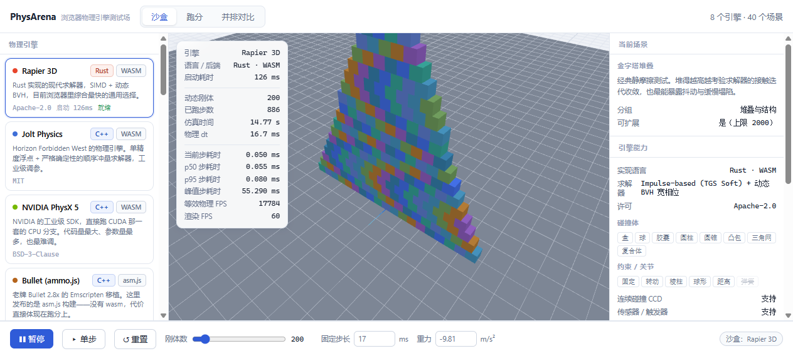
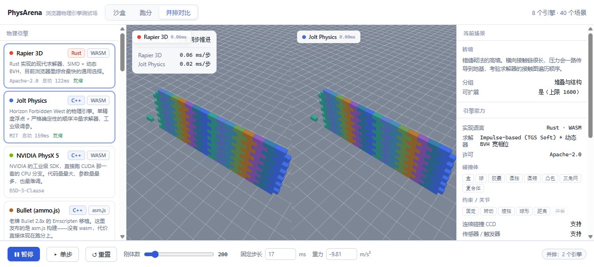
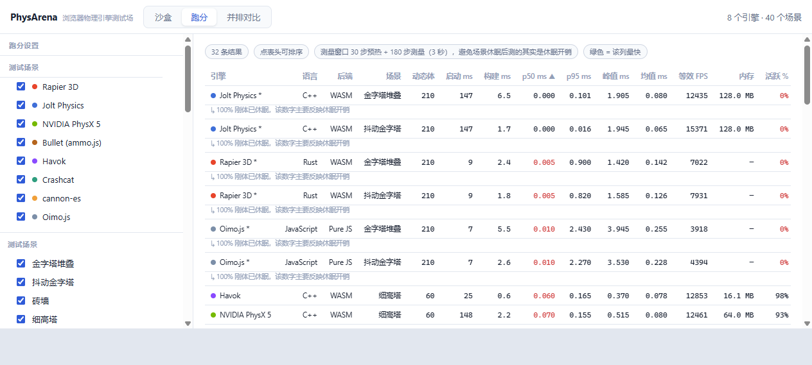
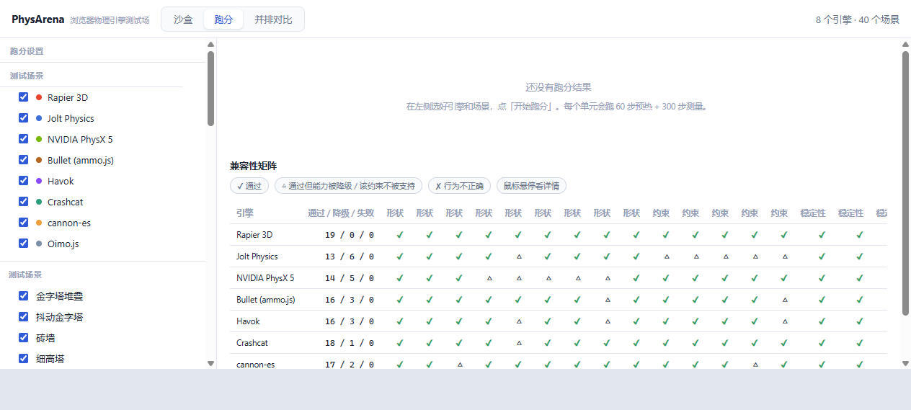
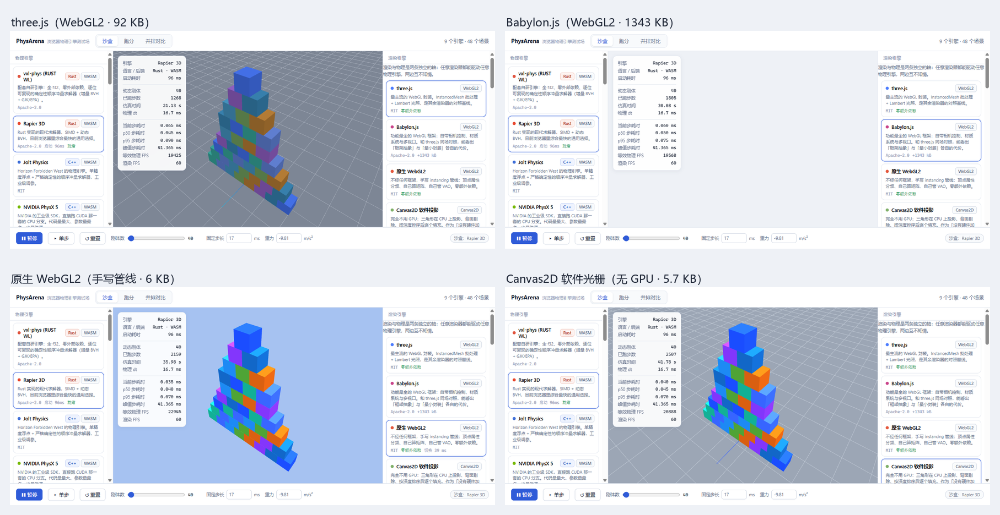
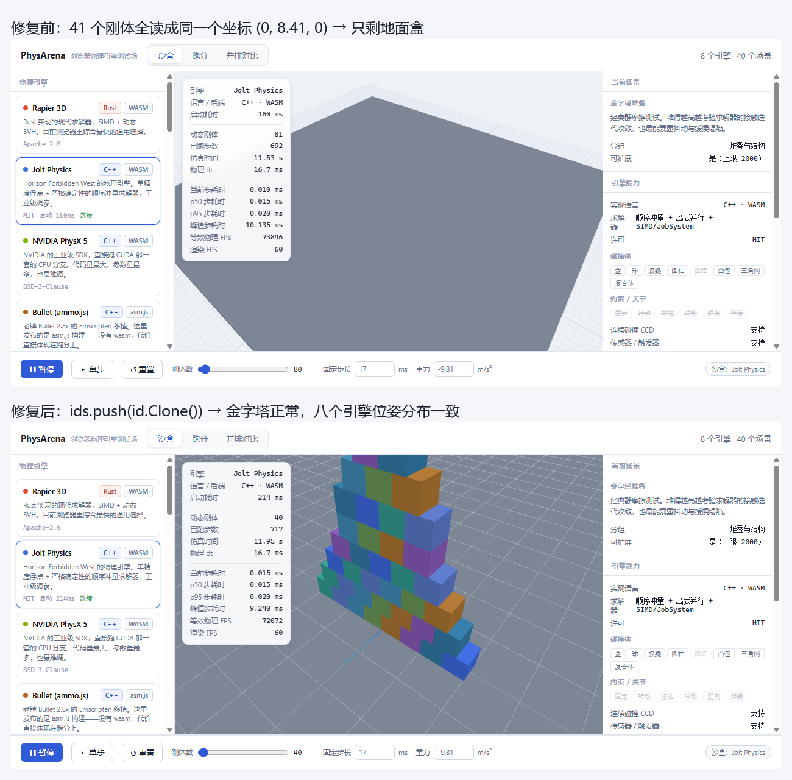

# PhysArena · 浏览器物理引擎测试场

这是一个**双轴**测试场，两条轴互相独立、可自由搭配：

- **物理轴**：9 个求解器——自研的 **vxl-phys（RUST WL）**、Rust 的 Rapier、C++ 的 Jolt / PhysX 5 / Bullet / Havok、纯 JS 的 Crashcat / cannon-es / Oimo.js。
- **渲染轴**：4 个后端——**three.js**、**Babylon.js**、**手写原生 WebGL2**、**Canvas2D 软件光栅**（完全不用 GPU）。

任意渲染器都能驱动任意物理引擎，两侧互不知情。同一份 `WorldDesc` 喂给全部 9 个求解器，跑分时每个引擎接收**完全相同的固定 dt 序列**——否则计时和轨迹都不可比。所有渲染后端画的是**同一批三角形**，四个后端的相机位置实测逐位一致，所以画面差异只可能来自管线本身。

> **vxl-phys（RUST WL，自研）已在台上**（第 9 个引擎）：全 f32、零外部依赖、固定输入
> 逐位可复现，经 `wasm-bridge/`（零 unsafe）接入；本体素/三角网/凸包 + CCD 原生，
> 复合体按**并集凸包**近似，关节未接桥（如实标注）。调优记录与 Node 侧基准见
> [`VXL-OFFLINE.md`](VXL-OFFLINE.md)。



| 并排对比 | 跑分排行 | 兼容性矩阵 |
|---|---|---|
|  |  |  |

---

## 快速开始

```bash
npm install          # 安装引擎与构建依赖
npm run vendor       # 把无法走打包器的 wasm / 脚本拷进 public/vendor
npm run dev          # http://localhost:5180
```

`npm run dev` 与 `npm run build` 会通过 `predev` / `prebuild` 自动执行一次 vendor 拷贝。

```bash
npm run build        # 产出 dist/
npm run preview      # 预览构建结果
npm run typecheck    # 仅类型检查
```

**离线侧（vxl-phys 桥）指令**：`npm run build:vxl` 构建桥 → **必须再 `npm run build`**
（preview 服的是 `dist/`，否则跑旧 wasm）→ `node scripts/vxl-node-bench.mjs` 快回路自检。
详见 [`VXL-OFFLINE.md`](VXL-OFFLINE.md)。

### 无头驱动（自检矩阵 / 跑分）

```bash
npm run preview                 # 另开一个终端，或先起服务
npm run drive:selftest          # 19 探针 × 9 引擎，结果落 out/selftest.json
npm run drive:bench             # 9 引擎 × 8 场景，结果落 out/bench.json
```

驱动脚本（`scripts/arena-drive.mjs`）用 `playwright-core` 驱动本机 Edge，不下载浏览器；
`ARENA_TAG=name` 可给产物加后缀（如 `out/bench-after.json`）。

> **想看/测这个应用，用 `npm run preview`（或 `npm run dev` 起来之后直接刷新一次）。**
> dev server 的依赖预构建会在首次加载后触发一次整体刷新；如果你正好在这个瞬间看页面，会看到白屏或重载。生产预览没有这个问题，加载也更快。
> 若页面真的空白，右下角会出现红色错误条（同步错误 / 未处理的异步错误 / WebGL 上下文丢失 / 启动超时都会显示在那里），不会再默默白屏。

浏览器要求：支持 WebAssembly 与 WebGL2 的现代桌面浏览器（Chrome / Edge / Firefox）。
dev server 已开启 `Cross-Origin-Opener-Policy` / `Cross-Origin-Embedder-Policy`，方便后续启用多线程 WASM 构建。

### 深链接

```
?engine=jolt&scene=pyramid&bodies=300      # 直接打开某个引擎 + 场景 + 刚体数
?selftest=1                                # 自动跑完整兼容性自检矩阵
```

`?selftest=1` 会把结果发布到 `window.__physarena_report`，方便脚本或 CI 读取。

### 脚本化

页面里暴露了 `window.__physarena`：

```js
await __physarena.selectEngine('physx5');
await __physarena.selectScenario('pyramid');
await __physarena.setBodies(500);
await __physarena.runBench();          // 或 runSelfTest()
__physarena.getBenchResults();
__physarena.getSelfTestResults();
__physarena.simStateSummary();         // 诊断：每个引擎的刚体数 / 非有限位姿 / 四元数模
__physarena.renderProbe();             // 诊断：每个图层实际提交给渲染的实例矩阵分解
```

`renderProbe()` 是定位"画面不对"的第一站：它按**图层分别**列出每个 mesh 的实例数、最大基向量长度、以及实例坐标的 min/max。位姿退化成单点（如 Jolt 那个 `y=[8.41, 8.41]`）一眼就能看出来，不必在渲染层猜。

> 取的时候要逐层显式取（`probe['jolt']`），**不要**写 `probe[a] || probe[b]`——那会两次都拿到同一个图层，得出"数据完全一致"的假结论。

---

## 9 个引擎

| 引擎 | 语言 | 后端 | 许可 | 求解器 |
|---|---|---|---|---|
| **vxl-phys (RUST WL)** | Rust | WASM | Apache-2.0 | 顺序冲量（软接触 + 摩擦锥；2 子步 × 3 迭代）+ 关节族（8 迭代）+ 增量 BVH + GJK/EPA |
| **Rapier 3D** | Rust | WASM | Apache-2.0 | Impulse-based (TGS Soft) + 动态 BVH |
| **Jolt Physics** | C++ | WASM | MIT | 顺序冲量 + 岛式并行 + SIMD |
| **NVIDIA PhysX 5** | C++ | WASM | BSD-3-Clause | TGS/PGS，GPU 兼容架构 |
| **Bullet (ammo.js)** | C++ | **asm.js** | Zlib | Sequential Impulse + btDbvtBroadphase |
| **Havok** | C++ | WASM | MIT（WASM 版） | Havok 专有求解器 |
| **Crashcat** | TypeScript | 纯 JS | MIT | Jolt 风格顺序冲量 + 动态 BVH |
| **cannon-es** | TypeScript | 纯 JS | MIT | Sequential Impulse + SAP 宽相位 |
| **Oimo.js** | JavaScript | 纯 JS | MIT | Sequential Impulse |

> **vxl-phys** 是配套自研引擎（全 f32、零外部依赖、`#![forbid(unsafe_code)]`、固定输入
> 逐位可复现）。经 `wasm-bridge/`（同样零 unsafe：Rust 侧缓冲 + 导出数据指针）接入。
> 原生支持 盒/球/凸包/三角网 + **关节族**（球/转动/固定/棱柱/距离 + **速度马达**；
> 关节限位未实现，用到即标注）+ CCD；复合体按**并集凸包**近似（标注）。

> Bullet 这一项发布的是 **asm.js** 构建——`ammojs-typed` 包里没有 wasm 二进制。这本身就是个有用的数据点：同一份 C++ 代码，wasm 与 asm.js 的差距直接体现在跑分里。

---

## 10 个渲染引擎

渲染后端本身也是被比较的对象。同一个物理世界，十种画法：

| 渲染器 | 语言 | 后端 | 许可 | chunk | 特点 |
|---|---|---|---|---|---|
| **three.js** | JavaScript | WebGL2 | MIT | 372 KB | 最主流的 WebGL 封装，`InstancedMesh` + Lambert |
| **Babylon.js** | TypeScript | WebGL2 | Apache-2.0 | 5922 KB | 功能最全的框架，thin instance + 内置相机 / 材质 / 多视口 |
| **原生 WebGPU** | WGSL | WebGPU | MIT | 13 KB | 下一代 API：显式管线状态、WGSL、命令编码器 |
| **原生 WebGL2** | GLSL | WebGL2 | MIT | 15 KB | 手写 mat4、顶点属性分频、自己管 VAO 与实例缓冲 |
| **原生 WebGL1** | GLSL | WebGL1 | MIT | 12 KB | 上一代 API：GLSL 100、无 VAO、实例化靠 ANGLE 扩展 |
| **点云** | GLSL | WebGL2 | MIT | 9 KB | 每个刚体一个顶点，一次 `drawArrays` 画完整个场景 |
| **线框** | GLSL | WebGL2 | MIT | 9 KB | 去重后的边，顶点吞吐翻三倍、像素填充降到几乎为零 |
| **Canvas2D 软件投影** | TypeScript | Canvas2D | MIT | 13 KB | 完全不用 GPU：CPU 投影 + 背面剔除 + 画家算法 |
| **SVG 多边形** | TypeScript | Software | MIT | 8 KB | 每个三角形一个 `<polygon>` 元素，DOM 后端的下限 |
| **CSS 3D 合成** | TypeScript | Software | MIT | 7 KB | 每个刚体一个 `div`，透视与排序交给浏览器合成器 |

**框架税一目了然**：Babylon 5922 KB、three 372 KB，而八个手写后端全部在 7–15 KB。全部是懒加载 chunk，选中哪个才下载哪个。

**中间那六个后端不是凑数，每一个都在回答一个具体问题**：点云给出「保真度换速度」的上界；线框分离顶点吞吐与像素填充；WebGL1 量出 VAO 和核心实例化省掉了多少；SVG 与 CSS 3D 探 DOM 后端的天花板；WebGPU 则是同一件事用显式管线再做一遍。



四点值得说明：

**几何是共享的。** 每个后端都消费同一份引擎无关的三角形数据（`src/render/geometry.ts`），所以换后端不会换网格——画面差异只可能来自管线本身。

**相机是共享的。** 四个手写 GL 后端共用 `src/render/glCommon.ts` 里的同一份取景与轨道相机代码；框架后端的取景公式也逐系数对齐，实测同一场景下相机位置完全相同（`[7.03, 15.68, 8.72]`）。框架各自的相机约定不同（Babylon 的 `alpha` 从 +X 量起而非 +Z），照搬会得到镜像视角。

**环境跑不了的会说明原因，不会消失。** WebGPU 在没启用的浏览器里仍然出现在列表中，显示为禁用并附上原因——「你的浏览器跑不了这个」是关于环境的事实，不是一个不存在的渲染器。

**软件光栅的两道守卫**：三角形预算（9000/帧）与实例预算（420），超限时降质量而不是掉帧。地面用「地平线填充 + 线段近平面裁剪」绘制——140 m 的平面在任何可用机位下都有角点落在相机背后，直接投影会整块消失。

**相机是等价的。** 四个后端的取景公式逐系数对齐，实测同一场景下相机位置完全相同（`[7.03, 15.68, 8.72]`），实例数 61、三角形 732 也对得上。框架各自的相机约定不同（Babylon 的 `alpha` 从 +X 量起而非 +Z），照搬会得到镜像视角，这一点已在实现里处理。

**框架税是真实的。** 同一个金字塔，three.js 92 KB、Babylon.js 1343 KB，而手写管线 6 KB——差了三个数量级。三者都是懒加载 chunk，只有选中该渲染器时才会下载。

**软件光栅的两道守卫**：三角形预算（9000/帧）与实例预算（420），超限时降质量而不是掉帧。地面用「地平线填充 + 线段近平面裁剪」绘制——140 m 的平面在任何可用机位下都有角点落在相机背后，直接投影会整块消失。

---

## 三种用法

### 1. 沙盒（默认）

单引擎实时仿真。点引擎卡片即可**热切换**，相机与场景参数保持不变，世界在切过去之后立刻重建。
HUD 显示当前步耗时、p50 / p95、峰值、等效物理 FPS 与渲染 FPS。

### 2. 跑分

勾选引擎与场景 → 「开始跑分」。每个引擎先启动一次，再对每个场景执行：

```
构建世界 → 预热 30 步（不计时） → 测量 180 步（逐步计时）
```

**测量窗口刻意取短（3 秒）。** 场景一旦稳定，引擎就让它休眠，测出来的就不再是求解开销而是休眠开销——用 300 步窗口时，Jolt 在 210 刚体的金字塔上跑到过 170 万步/秒。

**并且窗口是"睡眠感知"的**（本轮修复）：测量循环每 16 步查一次动态体是否全部休眠，
一旦全部休眠就**提前结束窗口**并在结果里记下 `sleep_onset_step` + 一条说明——
而不是让后半段样本悄悄变成休眠开销。休眠比例只在**动态体**上统计（静态体不再
算作"睡着"，此前的口径会让 Jolt/Havok 的活跃度天生偏低）。

结果给出 p50 / p95 / 峰值 / 均值 / 标准差 / 等效 FPS / 堆内存 / 活跃度 / 休眠起始步 / **状态指纹**，可导出 CSV 或 JSON。

- **顺序执行**，不并行。并行会让引擎互相争抢 CPU，数据就没有意义。
- 单格 30 秒硬上限，慢引擎（尤其是 asm.js 的 Bullet）不会把整轮跑分拖死，超时样本会标注为不完整。
- **状态指纹**：把最终所有刚体位置量化后哈希。指纹一致的引擎说明它们对同一个问题给出了同一个解。

### 3. 并排对比

最多 4 个引擎分屏同步推进同一场景，共用一个相机与一套 dt，每个分屏左上角实时显示该引擎的单步耗时。分屏各自独立计算投影矩阵，不会横向拉伸。

---

## 实测跑分（9 引擎 × 8 场景）

`npm run drive:bench`（Edge 无头，同一台机器、同一批场景、逐格顺序执行；睡眠感知窗口）：

**p50 单步耗时（ms，越低越好）**

| 场景 | vxl-phys | Rapier | Jolt | PhysX 5 | Bullet | Havok | Crashcat | cannon-es | Oimo |
|---|---|---|---|---|---|---|---|---|---|
| 金字塔堆叠（210 体） | 1.70 | 0.98 | 1.45 | **0.42** | 3.74 | 0.53 | 1.62 | 3.22 | 1.95 |
| 砖墙（200 体） | 1.36 | 0.76 | 0.15 | 0.38 | 3.42 | 0.49 | 1.25 | 3.49 | **0.04**※ |
| 球坑（400 体） | 0.89 | 0.92 | 1.67 | **0.50** | 3.10 | 0.52 | 2.18 | 2.35 | 1.00 |
| 铰链链（40 体） | 0.10 | 0.09 | **0.05**‡ | 0.04 | 0.31 | 0.05 | 0.18 | 0.14 | 0.05 |
| 布娃娃群（110 体） | 1.83 | 0.36 | 0.36‡ | **0.17** | 1.24 | 0.17 | 0.76 | 300.84† | 0.34 |
| 弹簧网格（113 体） | 0.63 | 0.21 | 0.07※‡ | 0.11 | 0.64‡ | 0.18 | 0.37 | 0.35 | 0.05※‡ |
| CCD 穿透地狱（20 体） | 0.05 | 0.04 | 0.06 | **0.02** | 0.10 | 0.02 | 0.11 | 0.04 | 0.00 |
| 三角网地形（200 体） | 2.41 | 1.29 | 0.49 | **0.28** | 1.75 | 0.38 | 0.82 | 9.15 | 0.24 |
| **8 场景平均** | 1.12 | 0.58 | 0.54 | 0.24 | 1.79 | 0.29 | 0.91 | 39.95 | 0.46 |

※ = 该格动态体已（部分）休眠，数字主要反映休眠开销（`sleep_onset_step` 已在结果里标出）。
‡ = 该引擎在本次集成下**关节被跳过**（场景按自由刚体运行，与其它的同一格不可比）：Jolt 全部关节场景（其绑定未暴露关节工厂）、Bullet 的弹簧网格、Oimo 的弹簧网格。
† = cannon-es 布娃娃触及 30 s 单格上限，样本不完整（已标注）。

**本批是同一次闲时扫描**（2026-09-15，第 3 批；Edge 无头，逐格顺序执行）：9 引擎 × 8 场景
在同一台机器、同一批场景、同一次会话里测完，**跨引擎可比**。三批的机器状态不同
（① 有编译负载：vxl 金字塔 3.00；② 闲时：1.92；③ 本批：1.70），**跨批只比"同批内的
相对位置"**；本批 Rapier 0.98 ≈ 第 2 批 0.97（对照未变）⇒ vxl 从 1.92 到 1.70 的
**−11.5%** 是真实改进，且与外推吻合（同进程交错 A/B 实测的两项：接触点内联数组
−4.1%、参与式降点 −7.3%）。

**读法**：这是"各引擎默认参数 + 浏览器 wasm/asm.js"的横向对比，不是等算力的对比——
每个引擎的默认迭代数、SIMD、并行策略都由它自己决定。自研引擎（vxl-phys）当前定位：
**中游偏上**（平均 1.12 ms，9 引擎第 4）。金字塔**距 Jolt 的差距从 1.47× 收窄到
1.17×**（1.92 vs 1.31 → 1.70 vs 1.45），距 Rapier ≈1.7×、距 PhysX ≈4×。
它的长项是**确定性**（同输入逐位可复现，上表每格都带状态哈希）与**零依赖/零 unsafe**；
调优史见 [`VXL-OFFLINE.md`](VXL-OFFLINE.md)（金字塔从 9.47 压到 1.70 ms）。

**读法**：这是"各引擎默认参数 + 浏览器 wasm/asm.js"的横向对比，不是等算力的对比——
每个引擎的默认迭代数、SIMD、并行策略都由它自己决定。自研引擎（vxl-phys）当前定位：
**中游偏上**（平均 1.17 ms，9 引擎第 4；金字塔/砖墙/球坑/三角网距第一梯队 ≈1.3–2.5×，
关节场景已接桥、与 Rapier/PhysX/Havok/Crashcat 同列可比）。它的长项是**确定性**
（同输入逐位可复现，上表每格都带状态哈希）与**零依赖/零 unsafe**；调优史见
[`VXL-OFFLINE.md`](VXL-OFFLINE.md)（金字塔从 9.47 压到 1.92 ms）。

> **口径提醒**：本表全部是**浏览器**读数（与其它引擎同口径）。`VXL-OFFLINE.md` 里的
> "Node 跑分"只用于引擎自比（约比浏览器快 1.5×），**勿与本表混比**。

---

## 48 个内置场景

| 分组 | 场景 |
|---|---|
| **堆叠与结构** | 金字塔堆叠、抖动金字塔、砖墙、细高塔、随机堆积、叠叠乐、球体金字塔、圆柱叠叠乐 |
| **经典动力学** | 多米诺、螺旋多米诺、斜坡滚落、牛顿摆、陀螺群、弹力球雨、球坑、阶梯下落、跷跷板平衡、旋转平台 |
| **约束与关节** | 铰链链、绳桥、布娃娃群、悬挂塔、曲柄滑块机构、电机车轮、弹簧网格 |
| **极端工况** | CCD 穿透地狱、无 CCD 对照组、炮弹轰墙、微小物体地狱、窄缝拥挤、质量比悬殊、远离原点、碎裂堆、密集接触网格 |
| **破坏与流体** | 布尔切割、布尔挖空、破坏塔、断桥、水坝崩塌、液体堆积、液压夹、高压柱 |
| **碰撞形状** | 凸包混战、形状动物园、复合体货箱、三角网地形、胶囊雨、传感器区域 |

**「破坏与流体」这一组测的是别的东西。** 前面的分组测「站不站得住」和「飞得对不对」，这一组测两件它们覆盖不到的：

- **布尔语义的破坏**——一个整体切成 N 块，切面零间隙，从切开那一帧起求解器就要处理十几对互相穿透的接触面。这是深度穿透恢复能力的直接考验，各引擎差别极大。
- **流体（粒子近似）**——没有任何引擎内置 SPH，但几百个低摩擦球挤在有限体积里就是水的经典替身，而且它是刚体堆叠永远产生不出的接触密度：每颗粒子四面都贴着邻居。实测 Rapier 在 400 颗粒子上 p50 = 1.45 ms，是金字塔 60 体（0.05 ms）的 29 倍。

**「高压」** 把同样的想法推到迭代求解器明显失效的地方：8 倍密度重块压在轻质床层上，以及高到让 1e-4 的每步误差累积成可见倾斜的柱体。

刚体数可在底部滑杆调整（上限随场景而异），拖动结束即重建。

---

## 兼容性自检矩阵

「跑分」页里还有一个自检按钮：**19 项探针 × 9 个引擎**，检查的不是速度而是正确性——形状能否落地、约束拉不拉得住、堆叠会不会塌、CCD 挡不挡得住高速弹丸、静置后会不会休眠、自由落体有没有能量增益、**多个刚体是否真的各在各的位置**。

最后一项（`stability-distinct`）是特意加的：8 个互不接触的盒子各自落位，断言它们的 x 互不相同。**其余的探针都只读"某一个"刚体，所以一个把同一刚体句柄发给所有索引的适配器可以骗过整张矩阵**——Jolt 就曾经这样（41 个实例全部读成 `(0, 8.41, 0)`），而当时 18 项探针全绿。

当前实测结果（`?selftest=1` 或 `npm run drive:selftest` 可复现）：

| 引擎 | 通过 | 降级 | 失败 |
|---|---|---|---|
| Rapier 3D | 19 | 0 | 0 |
| Crashcat | 18 | 1 | 0 |
| Bullet (ammo.js) | 16 | 3 | 0 |
| Havok | 15 | 4 | 0 |
| cannon-es | 15 | 4 | 0 |
| Jolt Physics | 13 | 6 | 0 |
| PhysX 5 | 13 | 6 | 0 |
| vxl-phys (RUST WL) | 15 | 4 | 0 |
| Oimo.js | 10 | 9 | 0 |

「降级」= 通过，但部分能力被替换或关闭，悬停每一格可以看到具体原因。**没有任何一项是静默失败**——不支持的形状、被跳过的关节、被近似的约束都会标注出来。（vxl-phys 的 4 项降级全部是**几何近似**：胶囊/圆柱/圆锥→凸包、复合体→并集凸包；**5 个关节探针已全部转正**。）

「降级」= 通过，但部分能力被替换或关闭，悬停每一格可以看到具体原因。**没有任何一项是静默失败**——不支持的形状、被跳过的关节、被近似的约束都会标注出来。

> **本轮修复（第二轮）**：此前矩阵里 `shape-trimesh` 与 `stability-ccd` 两个探针读的是
> **静态体**（三角网地形 / 薄墙），它们**永远不可能失败**——整张矩阵 0 失败有一部分是假的。
> 现在两个探针读真正的动态体（球 / 弹丸），并加了"运动断言"（弹丸没有初速度也算失败）；
> `stability-energy` 补了位置断言（不落体的引擎不再蒙混过关）；`stability-distinct`
> 只统计动态体（静态地面此前白送一个"不同 x"的名额）。
> 修好后暴露的真实差异：PhysX 的 CCD 在这套集成下**不生效**（见「已知限制」）、
> cannon/cannon-es 的三角网/铰链限位缺失被如实标注。

---

## 统一指标面板

沙盒 / 跑分 / 并排三种模式**共用同一套字段和同一套口径**，所以两次运行的读数可以逐行对上。共 6 节 41 项：

| 节 | 内容 |
|---|---|
| 场景与引擎 | 场景名、引擎身份、引擎启动耗时、世界构建耗时、状态指纹 |
| 时间 | 物理步 p50 / p95 / p99 / 峰值 / 抖动 / 等效物理 FPS / 渲染帧率 / 固定步长 / 步数 / 仿真时间 |
| 工作量 | 动态刚体 / 刚体总数 / 关节 / 引擎原生刚体 / 碰撞形状 / **每步接触对** / 约束数 / 休眠比例 |
| 内存 | 引擎堆占用 / 渲染缓冲 / 共享几何缓存 / 页面 JS 堆 |
| 渲染管线 | 后端 / 渲染器 / 绘制调用 / 三角形 / 实例数 / 几何体 / 纹理 / 着色器程序 / 渲染器体积 / 切换耗时 |
| 宿主 | 视口尺寸 / 绘图缓冲 / 设备像素比 / 硬件加速（真实 GPU 型号） |

**测不到的项写「—」加原因，绝不写 0。** 这是这个项目最硬的一条规矩：

- cannon-es 是纯 JS，没有独立堆可测——它报的是「纯 JS 引擎，没有独立堆可测；页面 JS 堆包含 UI 与全部渲染器，不能当作它的内存」，而不是把页面堆数字塞进去充数。
- PhysX / Havok 的 embind 只暴露 `HEAPU8.byteLength`，那是**堆容量**不是使用量，面板里明确标注了这一点。
- 页面 JS 堆单独列一行，并写明「不是求解器的内存」。
- Rapier 等没暴露接触对的引擎显示「该引擎未暴露接触对计数」。

**接触对是最有解释力的一列。** 它比刚体数更能说明代价：同样 60 个刚体，全部休眠时是 0 对接触，密集堆叠时可能上百对。

`__physarena.metrics()` 导出扁平化的全部指标，便于脚本比对或写进报告。

## 守卫（兜底）

这个测试场同时跑 9 个第三方求解器、4 个渲染器和大堆 wasm，每一处边界都可能以「整页挂掉」的方式失败。所以每一处跨界调用都过了守卫：

- **调用隔离**：`step` / `readStates` / `sync` / `render` / `stats` 全部经 `attempt()` 包裹。某个求解器抛错只损失那一个画面，不会带走整个会话。
- **自动隔离**：连续失败 3 次的子系统被标记为不可用——已损坏的 wasm 模块会持续抛错，继续调用只是白烧帧——并在面板里列出来。
- **错误折叠**：4 秒窗口内完全相同的错误合并成一条并计数，不会刷爆日志。
- **帧预算**：单次 step 超过 140 ms 记一条「超出预算」事件。JS 无法被中断，但「页面感觉卡住」从此变成一个数字。
- **帧看门狗**：记录最差帧耗时，超过 250 ms 判定为停滞，直接显示在指标面板里。
- **上下文丢失**：渲染器丢上下文时给出可读提示和可选动作（换渲染器 / 刷新），而不是白屏。
- **启动隔离**：渲染器注册表用 `allSettled` 加载；任何一个渲染器模块加载失败只把它自己从列表里去掉，不影响启动。
- **软栅配额**：Canvas2D 超过三角形 / 实例预算时降质量，并记一条「配额降级」。

守卫事件实时显示在指标面板的「守卫」一节，也可以通过 `__physarena.guardLog()` 读取。

## 导入自己的模型

把 `.glb` / `.gltf` / `.obj` 直接拖进画面。模型会被：

1. 解析并合并所有网格的顶点；
2. 归一化到最长轴 2 米；
3. 约简为**凸包**（上限 256 个顶点）；
4. 生成一个新场景「导入模型 · 你的文件名」，里面是一堆该物体从空中落下堆叠。

物理引擎不能直接用渲染网格做碰撞体，约简成凸包正好是这 9 个引擎里最快的表示。

---

## 架构

```
src/
  core/
    types.ts       引擎无关的场景中间表示（WorldDesc / BodyDesc / JointDesc）
    stats.ts       分位数统计与滑动窗口
    simulation.ts  固定步长累加器 + 计时（累加器在这里，不在引擎里）
    bench.ts       批量跑分编排与 CSV 导出
    selftest.ts    19 项兼容性探针与矩阵执行器
    metrics.ts     统一指标模型与采集（三模式共用）
    guard.ts       守卫：调用隔离 / 自动隔离 / 错误折叠 / 帧看门狗
  engines/
    base.ts        状态数组、保真度备注、关节跳过计数
    shared.ts      形状降级链、体积/质量计算、四元数工具
    hull.ts        点云 → 显式凸包（cannon-es 需要顶点+面）
    registry.ts    9 个引擎的元数据 + 懒加载器
    <9 个适配器>.ts
  render/
    types.ts       IRenderEngine / IRenderLayer / RenderStats，与物理侧一一对应
    geometry.ts    引擎无关的三角形数据 + 形状签名 + 配色（所有后端共用）
    glCommon.ts    矩阵 / 着色器 / 轨道相机 / 地面网格，四个手写 GL 后端共用
    registry.ts    10 个渲染后端的元数据 + 懒加载 + 可用性探测
    layout.ts      分屏栅格，GPU scissor 矩形与 DOM 标签共用
    engines/       three · babylon · webgpu · webgl2 · webgl1 · points
                   wireframe · canvas2d · svg · css3d
  scenarios/       48 个场景，按分组拆分（含「破坏与流体」）
  ui/
    app.ts         三模式外壳、槽位管理、HUD、跑分面板、指标面板
    dom.ts         微型 hyperscript
    importer.ts    GLTF/OBJ → 凸包
```

### 两条轴对等地插入

物理侧和渲染侧用同一个模式扩展：

```ts
// 物理：换求解器
interface IPhysicsEngine { init(); build(WorldDesc); step(dt); readStates(); stats?(); }

// 渲染：换后端
interface IRenderEngine { init(host); addLayer(id); render(slots); frame(...); stats(); }
```

两边都是「懒加载注册表 + 元数据前置 + 统一的生命周期钩子」，所以**加第 5 个渲染器和加第 10 个物理引擎是同一个动作**：写一个实现 `meta` 和几个钩子的文件，注册进 `MODULE_IDS`。

### 统一适配接口

```ts
interface IPhysicsEngine {
  readonly meta: EngineMeta;      // 语言 / 后端 / 许可 / 能力清单
  init(): Promise<void>;
  build(desc: WorldDesc): void;   // 每次换场景、换引擎数量都重建
  step(dt: number): void;         // 恰好一步固定步长
  readStates(): BodyState[];      // 与 desc.bodies 索引对齐
  applyImpulse?(index, impulse, point?): void;
  stats?(): EngineStats;
  dispose(): void;
}
```

每个适配器只实现五个引擎相关的钩子（`init` / `buildWorld` / `stepWorld` / `syncStates` / `disposeWorld`），其余由 `PhysicsEngineBase` 负责。

### 三处刻意的设计

**固定步长归 PhysArena 管。** `Simulation` 持有累加器，每个引擎每帧收到完全相同的 dt 序列。让引擎自己管累加器（例如 cannon-es 的 `world.step(dt, timeSinceLastCalled, maxSubSteps)`）就没法比较了。

**形状降级是显式的。** 引擎缺某个原始体时按 `圆锥 → 凸包 → 盒` 逐级降级，并在检视面板里标出来。静默替换会让跑分数字失去意义。

**跑分窗口避开休眠期，并报告休眠比例。** 见上文「跑分」一节。

---

## 已知限制

### 引擎能力

- **PhysX 5** 的凸包/BVH 烘焙需要在 WASM 堆上手工写指针，实测会触发**不可恢复**的内存越界（整个模块报废），因此这里不提供凸包能力，圆锥/圆柱/凸包/复合体会降级为盒并标注；三角网是原生支持的。PhysX 的 wasm 构建是浏览器专用的（`ENVIRONMENT=web`），无法在 Node 下测试。
  - **该构建也没有 `PxCylinderGeometry`**（运行时实测 `not a constructor`）：此前 capability 曾漏标圆柱为"原生支持"，走到固定 0.3 m 的兜底盒；现在圆柱按 `圆柱→凸包→盒` 正常降级并标注。
- **PhysX 5 的 CCD 在这套集成下不生效**（本轮实测，隔离复现）：场景级 `eENABLE_CCD` + `eENABLE_ACTIVE_ACTORS`、body 级 `eENABLE_CCD`、4 MB scratch block、`ccdMaxPasses=4` **全部打开**，240 m/s（4 m/步）的弹丸仍然原样穿过 0.1 m 薄墙（终点 = 无阻挡位置 x=466）；同一场景 15 m/s 的对照正常停在墙上——碰撞本身没问题，是 CCD pass 没跑。因此 `capabilities.ccd` 改为 `false`（与 Jolt 关节同一策略：不宣称做不到的能力），矩阵里该格显示为「声明不支持 CCD，穿透属预期」。
- **Jolt** 本身有全部关节类型，但通过这个 WebIDL 绑定创建的约束（`BodyInterface.CreateConstraint` 与官方的 `TwoBodyConstraintSettings.Create` 两条路径都试过）会返回**合法但完全不生效**的约束对象，已在隔离环境复现，因此关节声明为不支持、关节场景按自由刚体运行并标注。
- **Havok** 没有 revolute / spherical / fixed 这类关节工厂，全部用六轴通用约束模拟（free / limited / locked）；距离约束用 `LINEAR_DISTANCE` 轴近似（刚度/阻尼未建模，已标注）；不支持 CCD 与传感器，适配器对用到它们的场景给出逐体提示。
- **cannon-es** 没有胶囊、圆锥（用自带 Cylinder 近似）、棱柱约束；也没有 per-body 摩擦——适配器把摩擦/恢复系数量化后建立 `ContactMaterial` 配对。三角网只与球/平面碰撞（凸体会穿模，已标注）；`LockConstraint` 忽略锚点（固定关节锚点近似为两体中点，已标注）；铰链不支持角度限位（已标注）；`mass` 走 `密度 × 体积`（此前用固定 0.125 m³ 的经验体积，导致它的盒/球质量比与其它引擎不一致）。
- **Oimo.js** 只认球 / 盒 / 圆柱，只接受欧拉角（度）作为初始旋转；`jointDistance` 实测拉不住物体（9.4 m 漂移），因此不提供；关节限位的 `0` 会被引擎的 `||` 默认值替换为 1 rad，适配器已按微小非零值规避。
- **Bullet** 是 asm.js 构建，大场景下明显慢，跑分时可能触及 30 秒上限；它的绑定没有暴露激活状态，休眠只能报告为「未上报」。传感器标志与 CCD 阈值按形状尺寸设置（此前是硬编码 0.05）。
- **Crashcat** 目前是 0.0.5，API 仍在稳定中；CCD 是**创建期设置**（`motionQuality`），此前的 `setMotionQuality?.(...)` 调用在 0.0.5 里不存在、被可选链静默吞掉——现在走创建设置。
- **vxl-phys**（自研，已在台上）：桥接 盒/球/凸包/**三角网**/**关节族**（球/转动/固定/棱柱/距离 + **速度马达**，桥 ABI `vxl_joint_add` / `vxl_joint_motor`）+ CCD + 材质与初始速度；复合体按**并集凸包**近似（标注）。**未实现**：关节**限位**（角度/行程，适配器逐条标注）、关节弹簧的软性（`spring` 退化为刚性距离并标注）、胶囊/圆柱/圆锥的原生形状（→凸包）。调优与回归基准见 [`VXL-OFFLINE.md`](VXL-OFFLINE.md)。

### 渲染

- 取景按**内容**而不是地面来定距离。`extent` 会被 120–200 m 的地面平面抬高，用它取景会把相机推到 ~100 m 外，7 m 高的金字塔在画面里只有几个像素。现在用动态刚体的水平半径，地面只作为距离上限。



### 本轮修复的真实缺陷

按"实测 → 定位 → 一次性修好 → 回归"的顺序修掉的问题，全部有可复现的证据：

| 症状 | 根因 | 修法 |
|---|---|---|
| **Jolt 面板整片灰色平面、看不到任何刚体** | `BodyInterface.CreateAndAddBody` 每次返回**同一个被复用的 `BodyID` 包装对象**，`ids.push(...)` 存进去的 N 个全是别名，全部指向最后创建的刚体。读位姿时 40 个刚体全报告同一坐标（`y=[8.41, 8.41]`），渲染出来自然只剩地面盒铺满视口 | 创建后立刻 `ids.push(id.Clone())`。修后 Jolt 的 `y=[0.5, 6.44]`，与 Rapier/Crashcat/PhysX/Bullet/Havok/Oimo 的 `0.5..6.4~6.5` 完全对齐 |
| 点几轮引擎卡片后整个标签页卡死 | 每次切换都把已 boot 的引擎丢掉、下次重新实例化 wasm（PhysX 5MB / Havok 2MB / ammo.js 1.8MB asm.js） | 引擎与 wasm 模块**常驻**，淘汰只丢"世界"。8 引擎连续切换 15 秒完成 |
| Bullet 布娃娃 231/231 刚体全 NaN | `btHingeConstraint.setLimit(lo, hi)` 在这版 ammo 里**必须传满 5 个参数**，2/3 参形式被静默接受但调参留空 → 求解器发散 | 传 `setLimit(lo, hi, 0.9, 0.3, 1.0)` |
| 各引擎布娃娃姿态差异过大（maxAbs 15~21） | 场景把关节锚点写成了**世界坐标**，而 IR 约定是**刚体局部坐标**。多数引擎"容忍"，只有 Bullet 炸 | 重写布娃娃场景为 rig-local；修后所有引擎 maxAbs 收敛到 6~9 |
| 长会话越来越卡 | 几何缓存按图层持久化、只增不减，每换一个场景就往 GPU 留一份 | 几何体归属"当前场景"，重建时一并 dispose。40 场景轮换后 `renderer.info.memory.geometries` 稳定在 5 |
| 跑分面板整页空白 | `benchPane` 建好了但**从未 append 进 DOM**；补上后又被 grid 自动放置挤进 56px 底栏 | append + 显式 `grid-row/column` 定位 |
| 白屏时无从下手 | WebGL 构造异常被异步启动路径吞掉；未处理的 Promise 拒绝完全不可见 | `window.onerror` / `unhandledrejection` 红色错误条 + 启动看门狗 + WebGL 守卫 + 上下文丢失提示 |

另外把 Bullet 的 emscripten 工厂改成**只实例化一次**（重复调用会重新编译 1.8 MB asm.js 并冻住主线程几十秒），并给每次 boot 加了 45 秒超时。

**回归验证**：兼容性自检矩阵 **19 探针 × 8 引擎，0 失败**（每项的通过数都只比新增的分散度探针 +1，降级与失败数完全没变）；金字塔场景下 8 个引擎的刚体位姿分布全部对齐（`0.5..6.4~6.5`），无一退化；40 场景 × 单引擎全通过；8 引擎轮换两轮后 JS 堆 138→149MB 基本持平、几何体 10、着色器程序 3、纹理 0 —— 没有泄漏。Jolt 的 `Clone()` 实测不泄漏：24 次世界重建 wasm 堆稳定在 128.0 MB。

可复跑的隔离探针：`node scripts/probe-jolt-bodyid.mjs`（断言别名存在、`new J.BodyID(id)` 不可用、`Clone()` 正确）与 `node scripts/probe-jolt-clone-cycle.mjs`（24 次世界重建的堆回归）。

### 第二轮修复的真实缺陷（本轮）

同样"实测 → 定位 → 一次性修好 → 回归"，证据全部可复跑：

| 症状 | 根因 | 修法 |
|---|---|---|
| **3 个探针永远不可能失败**（`shape-trimesh` / `stability-ccd` 读静态体；`stability-energy` 缺位置断言） | 探针取 `states[0]`/`states[1]`，恰好是**静态**地形/薄墙——y/x 恒定，判定分支不可达 | 改读动态体 + 运动断言（弹丸没获得初速度也判失败）+ 位置断言；修完立刻抓出真实差异（PhysX CCD 不生效） |
| 4 个适配器**从不读速度**（Bullet / Jolt / Havok / Crashcat） | `syncStates` 只拷位姿，`linearVelocity` 一直是 `build()` 里种下的 0 | 补齐速度读取；能量探针与 HUD 从"恒 0 通过"变成真检查 |
| 场景库 40 个场景里 20+ 处几何不自洽 | 逐场景核对：层级间 1 cm 互穿（金字塔）、出生柱被屋顶压住（289/300 在屋顶上）、运动学平台没有角速度（`rotating-platform` 从没转过）、螺旋多米诺没有触发者且间距超臂长、牛顿摆关节违例 0.55 m、球坑两面墙绕错轴躺在半空、跷跷板锚点相距 0.53 m、悬挂塔 `x = n*0.35` 常数造成 13.35 m 首段违例且 17 个箱子入土、曲柄机构整机埋在静态轨道里、布娃娃相邻胶囊全部互穿…… | 逐项按实测数字修正（摆放/锚点/步距/触发），并把"名不副实"的场景描述改成与实际一致 |
| 跑分测的是**休眠开销**而不是求解开销 | 场景在 t=0 就是静止接触；缩短窗口治标不治本 | 睡眠感知窗口：全部动态体休眠即提前结束并记 `sleep_onset_step`，活跃度只统计动态体 |
| 暂停中重建世界 → 视口全空 | `InstancedMesh` 新缓冲全零矩阵，而暂停时循环不同步 | 重建后立刻 `sync()` 一次 |
| 跑分进度文字永远停在"准备中…"、失败无提示 | 写 DOM 的选择器命中了静态段落，守卫条件永假；错误分支随后用 `benchRunning=false` 渲染，进度段整体不渲染 | 专用 `#pa-bench-msg` + 失败也渲染 |
| 跑分与自检可以并发启动 | 两个入口各查各的标志 | 单一 `busy` 互斥（含模式切换） |
| boot 超时后该引擎卡死到刷新 | `status='error'` 永不复位；超时的 wasm 实例变孤儿 | 超时复位为可重试 + 迟到实例 `dispose()` |
| 内存/状态指纹列点表头"排序"实际按 p50 重排 | `metric()` 的 `default` 落到 p50 | 无指标列不再响应排序 |
| 拖入文件名走 `innerHTML`（注入路径） | `showOverlay` 的 html sink | 插值转义 |
| 取景：`big-world`（5000 m 外）相机 13 km 外、`tower` 只露顶部 | `contentRadius` 相对**世界原点**且不含 Y | 内容包围盒（含 Y、相对内容中心），相机目标指向内容中心 |
| cannon 的相对质量全错 | 用固定 `0.125 m³` 经验体积算质量（盒/球质量比恒为 1.0，其它引擎 1.39） | 走 `密度 × 形状体积`（`mass-ratio` 场景的 87 万:1 前提才成立） |

### 第三轮修复的真实缺陷（双轴改造）

| 症状 | 根因 | 修法 |
|---|---|---|
| **Babylon 面板完全空白**（切过去只有背景色），但 `renderProbe()` 报出 2 个 mesh / 40 个 thin instance / 材质 ready，`stats()` 也报出正确的三角形数——数据全对、画面全空 | init 里的 `engine.runRenderLoop(() => {})`。Babylon 的 runRenderLoop 会启动**它自己的** rAF 循环，每帧 `beginFrame()` → 空回调 → `endFrame()`，而 `endFrame()` **会交换后缓冲**。于是它在本实验画完一帧之后，紧接着又提交了一个空帧 | 删掉那行——渲染循环由宿主驱动，`scene.render()` 自己会完成 begin/end frame |
| **SVG 后端让整个标签页卡死**（切过去无响应，8 分钟不返回） | 每帧 `svg.innerHTML = parts.join('')`：24 刚体场景即约 138 KB 的 HTML 要重新解析，60 Hz 下是每秒数 MB 的解析量 | 双层节流：三角形预算 1400 → 360、实例预算 120 → 48，且每 4 帧才重建一次（约 15 fps）；首帧强制渲染不跳过 |
| 并排对比下各后端 draw call 数差很多，看着像 bug | 三个 GL 后端按形状签名合批，`drawCalls` 是真实提交数；而 SVG / CSS 后端根本没有"绘制调用"这个概念 | 指标面板对缺少该概念的后端显示「—」加口径说明，绝不写 0 |
| 宿主指标（视口 / 绘图缓冲）在 SVG 与 CSS 后端恒为「—」 | 指标只查 `document.querySelector('canvas')`，而这两个后端的绘制目标是 `<svg>` 和 `<div>` | 改查 `.pa-canvas`（三种元素类型都带这个类），并对没有独立绘图缓冲的后端说明原因 |

**这一轮最值得记住的一条：数据对 ≠ 画面对。** Babylon 那次 `probe()` 全部正常——因为它读的是 CPU 侧数组，根本不经过 GPU。凡是渲染问题，最后一定要落到像素上验证：把 canvas `drawImage` 到临时 canvas 再 `getImageData` 稀疏采样，一眼就能拿到「100% 是背景色」这种决定性证据。这个检查现在是渲染器改动后的标准动作。
| 其余：Bullet 世界/scratch 泄漏、PhysX actor/shape/材质不释放、Havok 体先释放后移出世界、meshFactory 缓存键丢字段、导入模型 NaN 顶点、`RollingWindow` 注释与实现不符 | 见 `FIXPLAN.md` 台账 | 逐项修正 |

**回归验证**：自检矩阵 **19 探针 × 8 引擎，0 失败**（`out/selftest-final.json`）；
跑分 8 引擎 × 8 场景全部完成（除 cannon-es 布娃娃触及 30 s 上限、如实标注不完整）。
修复前/后矩阵快照各留一份：`out/selftest-before.json`（原版构建）与 `out/selftest.json`。
**当前状态（9 引擎 + 关节接桥后）**：19 × 9 **0 失败**（`out/selftest-joints.json`，
vxl-phys 15/4/0）；9 引擎 × 8 场景同批闲时跑分见 `out/bench-joints.json`。

### 其他

- PhysX / Havok / Jolt / Crashcat / cannon / oimo 的 per-body 密度通过质量或引擎内建密度近似；凸包与三角网的质量按 AABB 估算。
- 部分引擎不暴露可比的显存/堆数据，内存列会显示 `—`，不会用整页 JS 堆数字冒充实测值。

---

## 依赖

`three` · `vite` · `typescript`
`@dimforge/rapier3d-compat` · `jolt-physics` · `physx-js-webidl` · `ammojs-typed` · `@babylonjs/havok` · `crashcat` · `cannon-es` · `oimo`
